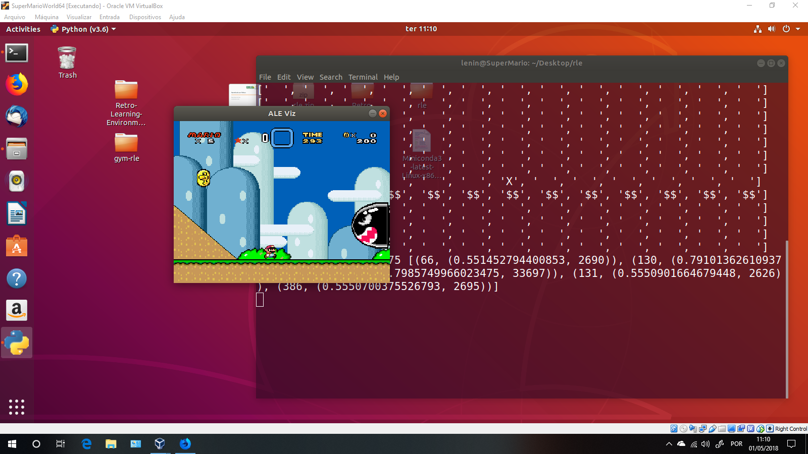

# Usando RLE e NEAT para fazer o Mario vencer uma fase no emulador SNES

**Using RLE and NEAT to make Mario win a fase on SNES emulator. UFABC 1Q/2018 - Machine Learning Class.**

Universidade Federal do ABC - Bacharelado em Ciência da Computação  
Aprendizado de Máquina 2018/Q1  

